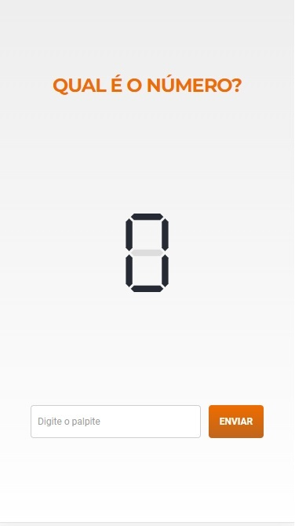
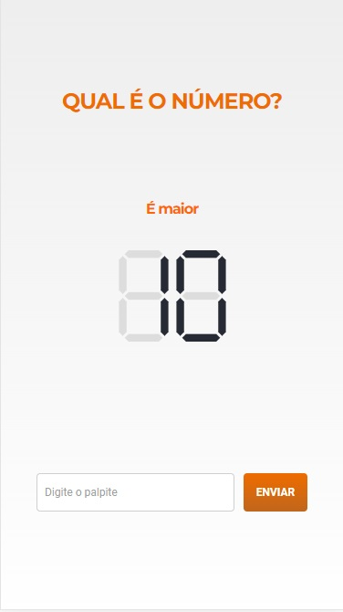
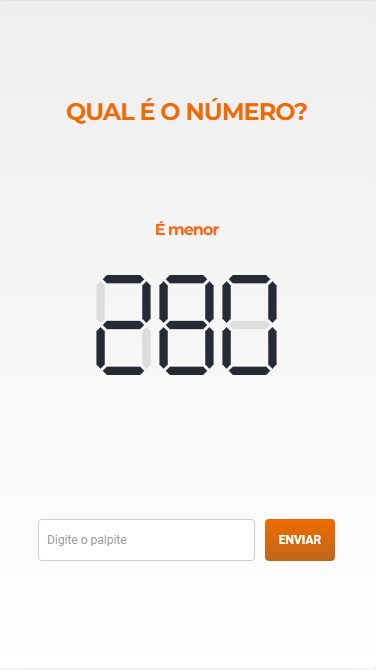
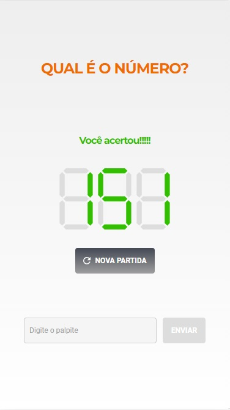
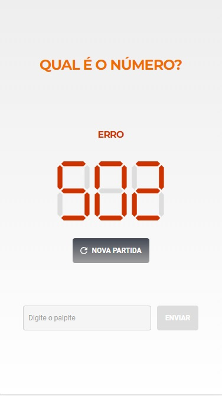

<h1>What is the number? - GAME</h1>

The project is a Web Game that you have to guess which number was chosen at random by a API

Developed to practice HTML, CSS and JavaScript.

<h2>Screens</h2>
<table>
<tr>
<th>Initial Screen</th>
<td></td>
</tr>
<tr>
<th>Setting Value</th>
<td></td>
</tr>
<tr>
<th>Attempt - Highest Value</th>
<td></td>
</tr>
<tr>
<th>Attempt - Lowest Value</th>
<td></td>
</tr>
<tr>
<th>Victory Screen</th>
<td></td>
</tr>
<tr>
<th>Error Screen</th>
<td></td>
</tr>
</table>

<h2>Getting Started</h2>
<pre>
<code>-git clone https://github.com/SetropLeo/What_Is_The_Number</code>
</pre>

<h2>Built With</h2>
<ul>
<li>HTML5</li>
<li>CSS3</li>
<li>JavaScript</li>
</ul>
